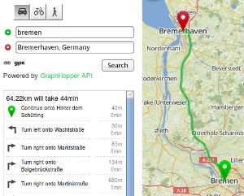

# GraphHopper Directions API for Business

With the [ GraphHopper Directions API for Business](https://graphhopper.com/#directions-api) you get a reliable and fast routing service with world wide coverage. We offer a Routing API for A-to-B routing optionally with turn instructions and elevation data. Also it is possible to get all distances between all locations with our fast Matrix API.


## How to Start

 1. To use the Directions API you need an API key. Get it for free [here](https://graphhopper.com/#directions-api).
 2. Read the documentation for the **Routing API**, the **Matrix API** and the **Geocoding API** below or try the examples in our dashboard.
 3. To increase your query limits for production you pay online within a few minutes via credit card or debit advice.

You can see the Routing and Geocoding API in action at [GraphHopper Maps](https://graphhopper.com/maps).

## Problems or Questions?

If you have problems or questions please see the [FAQ.md](FAQ.md) or [contact us](https://graphhopper.com/#contact).

## API Clients and Examples
                        
 * [JavaScript](https://github.com/graphhopper/directions-api-js-client)
 * [Java](https://github.com/graphhopper/directions-api-java-client)

Do not hesitate to share your client code with us!

## [Routing API](docs-routing.md)



The Routing API is documented [here](docs-routing.md).

The endpoint is `https://graphhopper.com/api/[version]/route`

You get an example response via:

`curl "https://graphhopper.com/api/1/route?point=51.131108%2C12.414551&point=48.224673%2C3.867187&vehicle=car&locale=de&debug=true&points_encoded=false&key=[YOUR_KEY]"`

Where you need to replace the key with your own

## [Matrix API](./docs-matrix.md)


The Matrix API is documented [here](./docs-matrix.md)

The endpoint is `https://graphhopper.com/api/[version]/matrix`

You get an example response for a 3x3 matrix looks via:

`curl "https://graphhopper.com/api/1/route?point=51.131108%2C12.414551&poit=48.224673%2C3.867187&vehicle=car&debug=true&key=[YOUR_KEY]"`

## [Geocoding API](./docs-geocoding.md)


The Geocoding API is not yet production grade. Please help us improve it and give us feedback! See the documentation [here](./docs-geocoding.md).

The endpoint is `https://graphhopper.com/api/[version]/geocode`

You get an example response via:

`curl "https://graphhopper.com/api/1/geocode?q=berlin&locale=de&debug=true&key=[YOUR_KEY]"`

Append `&debug=true` for a formatted output.

<!--
## Isochrone API


The Isochrone API is documented [here](./docs-isochrone.md).

The endpoint is `https://graphhopper.com/api/[version]/isochrone`

An example URL looks like:

`https://graphhopper.com/api/1/isochrone?q=52.511624,13.438339&time_limit=1200&vehicle=car&key=[your-key]`

Append `&debug=true` for a formatted output.
-->

## [Issues](https://github.com/graphhopper/web-api/issues)

If you have problems please report them [here](https://github.com/graphhopper/web-api/issues).


## [Terms of Services](https://graphhopper.com/terms.html)

Read the [terms of services](https://graphhopper.com/terms.html) carefully and make sure your user are agreeing to be bound by GraphHopper's Terms of Use too.

## Attribution

The standard package requires a prominent attribution of GraphHopper. This means you include a link to graphhopper.com where you utilize the GraphHopper Directions API. It is important to note that the user has to see this only one time e.g. once per application start or at the first website access. The user must have the possibility and enough time to read and click on the link e.g. including it only in a short living spash screen isn't appropriate where as including this in or below a search input is appropriate. For an example you can look at [GraphHopper Maps](https://graphhopper.com/maps/)

An html snippet for this is:

```html
powered by <a href="https://graphhopper.com/#directions-api">GraphHopper</a>
```

For small screens (less than 190mm diagonal) it can be only the link:

```html
<a href="https://graphhopper.com/#directions-api">GraphHopper</a>
```

If you need a custom or white-label solution please contact us.

Regardless of the package and additionally to our attribution you need to include attribution to [OpenStreetMap](https://www.openstreetmap.org/copyright/).

## HTTP Error codes

HTTP error code | Reason
:---------------|:------------
500             | Internal server error. It is strongely recommended to send us the message and the link to it, as it is very likely a bug in our system.
501             | Only a special list of vehicles is supported
400             | Something was wrong in your request
401             | Authentication necessary
403             | Not paid or API limit reached
