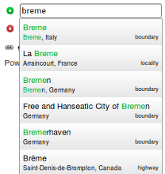

# Geocoding API



Geocoding is the process to fetch a coordinate (`latitude,longitude`) for a given
address string. Read more at [Wikipedia](http://en.wikipedia.org/wiki/Geocoding).

The URL path to obtain the coordinate  is `/geocode`

## URL parameters

Parameter   | Default | Description
:-----------|:--------|:-----------
q           | -       | Specify an address
locale      | en      | Display the search results for the specified locale. Currently French (fr), English (en), German (de) and Italian (it) are supported. If the locale wasn't found the default (en) is used.
limit       | 10      | Specify how many results you want
debug       | `false` | If `true`, the output will be formated.
point       | -       | The location bias in the format 'latitude,longitude' e.g. point=45.93272,11.58803

## Example output for the case type=json

```json
{
  "hits": [
    {
      "point": {
        "lat": 52.519854,
        "lng": 13.438596
      },      
      "osm_id": "62422",
      "name": "Berlin",
      "country": "Germany",
      "city": "Berlin"
    },
    {...
    }]
}
```

The JSON result contains the following structure:

JSON path/attribute | Description
:-------------------|:------------
hits                | The list of matching locations
hits[0].point       | The position of the address
hits[0].name        | The name of the entity. Can be a boundary, POI, address, etc
hits[0].city        | The city of the address
hits[0].country     | The country of the address
hits[0].osm_id      | The OSM ID of the entity

# Reverse Geocoding

The reverse geocoding has exactly the same response but requires an additional URL parameter `reverse=true`

## URL parameters

Parameter   | Default | Description
:-----------|:--------|:-----------
reverse     | true    | Required for reverse geocoding
point       | -       | The location to find amenities, cities etc. In the same format as the (forward) geocoding.
locale      | en      | Display the search results for the specified locale. Currently French (fr), English (en), German (de) and Italian (it) are supported. If the locale wasn't found the default (en) is used.
debug       | `false` | If `true`, the output will be formated.
