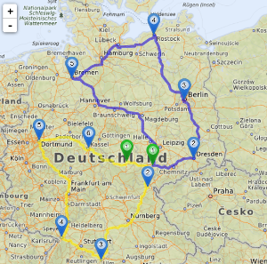
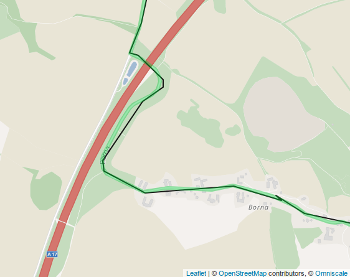

# GraphHopper Directions API

With the [ GraphHopper Directions API](https://graphhopper.com/#directions-api) you get reliable and fast web services for routing and more
with world wide coverage. We offer A-to-B routing via the Routing API optionally with turn instructions and elevation data as well as 
route optimization with various constraints like time window and capacity restrictions. Also it is possible to get all distances 
between all locations with our fast Matrix API.

The GraphHopper Directions API consists of the following parts:

 * the [Routing API](./routing.md), 
 * the [Route Optimization API](./route-optimization.md),
 * the [Isochrone API](./isochrone.md),
 * the [Map Matching API](./map-matching.md),
 * the [Matrix API](./matrix.md) and 
 * the [Geocoding API](./geocoding.md).

## How to Start

 1. To use the Directions API you need an API key. Get it for free [here](https://graphhopper.com/#directions-api).
 2. Read the documentation below or try the examples in our dashboard.
 3. To increase your query limits for production you pay online within a few minutes via credit card or debit advice.

You can see the Routing and Geocoding API in action at [GraphHopper Maps](https://graphhopper.com/maps). You can see the Route Optimization API in action in the [route editor](https://graphhopper.com/blog/2015/07/21/graphhoppers-new-route-optimization-editor/) available in the [dashboard](https://graphhopper.com/#directions-api), the route optimization uses the Matrix API under the hood.

## Problems or Questions?

If you have problems or questions please see the [FAQ.md](FAQ.md) or [contact us](https://graphhopper.com/#contact).

Or search [our public forum](https://discuss.graphhopper.com/c/directions-api).

## Pricing

The pricing is available [here](https://graphhopper.com/#pricing) or with all details about monthly/annually [in the dashboard](https://graphhopper.com/dashboard/).

## API Clients and Examples

 * [JavaScript client](https://github.com/graphhopper/directions-api-js-client) - try the [live examples](https://graphhopper.com/api/1/examples/)
 * [Java client](https://github.com/graphhopper/directions-api-java-client)
 * [Others](https://github.com/graphhopper/directions-api-clients-route-optimization) like C#, Ruby, PHP, Python, ... automatically created for the Route Optimization API with our [swagger spec](https://graphhopper.com/api/1/swagger.json).

Let us know your language requirements!
  
**Examples and Applications and Community supported clients**:

 * [Showcases](https://www.graphhopper.com/showcases/) from our customers
 * A community developed Swift client for the [Geocoding API](https://github.com/rmnblm/GraphHopperGeocoder) and [Routing API](https://github.com/rmnblm/GraphHopperRouting)

Do not hesitate to share your websites, apps or API clients with us!

### Bandwidth reduction

If you create your own client make sure it supports http/2 and gzipped
responses. 

For the Matrix and Route Optimization API the bandwidth can be further reduced especially for larger problems
if you [gzip the POST request](https://gist.github.com/karussell/82851e303ea7b3459b2dea01f18949f4)
too and specify the header `Content-Encoding: gzip` for those requests.

## Keep up-to-date

To get informed about the newest features and development follow us at [twitter](https://twitter.com/graphhopper/) or our [blog](https://graphhopper.com/blog/). Furthermore you can watch [this git repository](https://github.com/graphhopper/directions-api) of this documentation, sign up at our [dashboard](https://graphhopper.com/dashboard/) to get the newsletter or sign up at [our forum](https://discuss.graphhopper.com/c/directions-api). Pick the channel you like most.

# [Routing API](./routing.md)

[](./routing.md)

The Routing API is documented [here](./routing.md).

# [Route Optimization API](./route-optimization.md)

[](./route-optimization.md)

The Route Optimization API is documented [here](./route-optimization.md).

# [Isochrone API](./isochrone.md)

[](./isochrone.md)

The Isochrone API is documented [here](./isochrone.md)

# [Map Matching API](./map-matching.md)

[](./map-matching.md)

The Map Matching API is documented [here](./map-matching.md)

# [Matrix API](./matrix.md)

[](./matrix.md)

The Matrix API is documented [here](./matrix.md)

# [Geocoding API](./geocoding.md)

[](./geocoding.md)

The Geocoding API is documentation [here](./geocoding.md).

# [Terms of Services](https://graphhopper.com/terms.html)

Read the [terms of services](https://graphhopper.com/terms.html) carefully and make sure your user are agreeing to be bound by GraphHopper's Terms of Use too.

# [Attribution](./attribution.md)

Please read more about how to attribution the usage of the GraphHopper
Directions API [here](./attribution).

# HTTP Headers

HTTP header key | 	Description
:---------------|:-------------
X-RateLimit-Limit 	   | Your current daily credit limit
X-RateLimit-Remaining | 	Your remaining credits until the reset
X-RateLimit-Reset 	   | The number of seconds that you have to wait before a reset of the credit count is done
X-RateLimit-Credits 	 | The credit costs for this request. Note, it could be a decimal and even negative number, e.g. when an async request failed.

# HTTP Error codes

HTTP error code | Reason
:---------------|:------------
400             | Your request is not valid. For example, you specified too few or too many points.
401             | Authentication necessary
404             | Not Found. You receive 404 if the job_id cannot be found. Either this job has never been submitted or it has already been removed.
413             | Too many parameters in the URL. You then have to use the JSON format and POST requests.
429             | API limit reached. You also get an email with this information. You can find additional information in the header (see the section about 'HTTP Headers').
500             | Internal server error. Alarm bells start ringing and we get notified automatically. We try to fix this fast.
501 	           | Only a special list of vehicles is supported.


## Error Output
```json
{
  "message": "Cannot find point 2: 2248.224673, 3.867187",
  "hints": [{"message": "something", ...}]
}
```

Sometimes a point can be "off the road" and you'll get 'cannot find point', this normally does not
indicate a bug in the routing engine and is expected to a certain degree if too far away.

JSON path/attribute    | Description
:----------------------|:------------
message                | Not intended to be displayed to the user as it is currently not translated
hints                  | An optional list of details regarding the error message e.g. `[{"message": "first error message in hints"}]`
