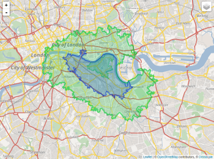

## Isochrone API

### Endpoint

The endpoint is `https://graphhopper.com/api/[version]/isochrone`

You get an example response via:

`curl "https://graphhopper.com/api/1/isochrone?point=51.131108%2C12.414551&key=[YOUR_KEY]"`

Where you need to replace the key with your own

### Introduction



Calculating an isochrone of a locations means to calculate
"a line connecting points at which a vehicle arrives at the same time", 
see [Wikipedia](http://en.wikipedia.org/wiki/Isochrone_map). 
It is also called **reachability** or **walkability**.

With the same API you can also calculate isodistances, just use
the parameter `distance_limit` instead of time_limit`.

### Use Cases

Our Isochrone API can be used in the following areas:

 * real estate analysis
 * realtors
 * vehicle scheduling
 * geomarketing
 * reach of electric vehicles
 * transport planning
 * logistics (distribution and retail network planning)

### API Clients and Examples

See the [clients](./index.md#api-clients-and-examples) section in the main document and [live examples](https://graphhopper.com/api/1/examples/#isochrone).

### Parameters

All official parameters are shown in the following table

Parameter   | Default | Description
:-----------|:--------|:-----------
point       | -       | Specify the start coordinate
time_limit  | 600     | Specify which time the vehicle should travel. In seconds.
distance_limit | -    | Instead of `time_limit` you can also specify the distance the vehicle should travel. In meter.
vehicle     | car     | Possible vehicles are bike, car, foot and [more](./supported-vehicle-profiles.md)
buckets     | 1       | For how many sub intervals an additional polygon should be calculated.
reverse_flow| false   | If `false` the flow goes from point to the polygon, if `true` the flow goes from the polygon "inside" to the point. Example usage for `false`: *How many potential customer can be reached within 30min travel time from your store* vs. `true`: *How many customers can reach your store within 30min travel time.*
debug       | `false` | If `true`, the output will be formated.

## Example output for the case type=json

```json
{
  "polygons" : [ {
    "properties" : {
      "bucket" : 0
    },
    "type" : "Feature",
    "geometry" : {
      "type" : "Polygon",
      "coordinates" : [ [ 13.351851, 52.513450], [ 13.350402, 52.516949], [ 13.352598, 52.522252], ... ]
    }
  }, {...}]
}
```


The JSON result contains the following structure:

JSON path/attribute | Description
:-------------------|:------------
polygons             | The list of polygons
polygons[0]          | One polygon in [GeoJson format](http://en.wikipedia.org/wiki/GeoJSON) can be directly used e.g. in JavaScript framework Leaflet via `L.geoJson(json.polygons).addTo(map)`
polygons[n - 1]      | The number of polygon is identical to the specified buckets in the query. Every polygon contains the bucket number in the properties section of the GeoJson.

